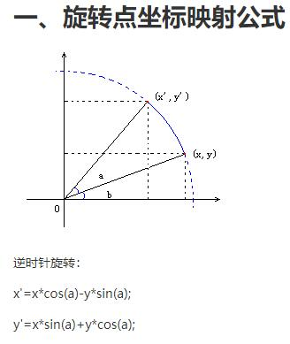

项目简介：本项目是斯坦福大学2020年秋的《计算机视觉基础和应用》CS-131课程练习。

目的：
1. 成体系：系统性的了解传统计算机视觉及其核心算法的原理和编程实现。
2. 数学能力：传统计算机视觉牵涉大量数学原理及其计算，可以通过此项目巩固和加深对高等数学、线性代数的理解，方便后续更高深算法的快速理解。
3. 编程能力：进一步锻炼如何将思想用代码实现。

# 2020版CS131课程大纲
- [x] hw0：基本的线性代数、NumPy和使用Python进行图像处理。——2020-10-21完成
- [ ] hw1：滤波器。（卷积、互相关、可分离滤波器）
- [ ] hw2：边缘-智能汽车车道检测。（Canny边缘检测、霍夫变换）
- [ ] hw3：全景图-图像拼接。
- [ ] hw4：聚类分割。
- [ ] hw5：线裁剪。
- [ ] hw6：目标检测。
- [ ] hw7：光流跟踪。
- [ ] hw8：相机模式。

# hw0 技术总结和提炼：2020-10-21

- 部分1 线性代数和numpy基操
  - 练习1.1 用numpy表示矩阵、行向量、列向量
    - np.array([[1,1,0]])，注意，即便是行向量、列向量，都必须要有两层[[]]，一层[]什么都不是。
  - 练习1.2 矩阵乘法
    - np.dot(a, b)或者a.dot(b)
  - 练习1.3 复杂的矩阵乘法：
    - 实现$(ab)(Ma^T)$
  - 练习1.4 求解特征值和特征向量。——暂未完成(后期有用到时再详细研究)
  - 练习1.5 实现一个任意维度的欧式距离计算函数。
    - ${distance}(u, v) = \sqrt{\sum_{i=1}^n (u_i - v_i)^2}$
- 部分2 图像处理
  - 练习2.1 加载和显示图像：
    - 使用skimage和PIL。
  - 练习2.2 裁剪图像：
    - 利用python的切片功能。
  - 练习2.3 亮度调整：
    - 用个公式对每个像素点值重新赋值。
  - 练习2.4 尺度（分辨率）调整：
    - 两层for遍历output图像的H和W，给每个像素值赋值。
  - 练习2.5 旋转图像：
    - 画一个图就知道绕原点的旋转坐标公式怎么推导出来。至于绕非原点坐标旋转，公式是一样的，只是先做个相对坐标转换，计算完后再把坐标转换回相对原点坐标值。
    - 

# 官方原始README
该存储库包含2017年秋季、2018年秋季和2019年秋季CS131迭代发布的作业，这是斯坦福大学由Juan Carlos Niebles和Ranjay Krishna教授的一门课程。作业涉及广泛的计算机视觉主题，应该使学生接触到广泛的概念和应用。

作业0介绍了如何在python和numpy中使用图像。它涵盖了基本的线性代数，对课程很有帮助。作业1通过理解卷积、线性系统和不同内核等概念，以及如何设计它们来寻找图像中的特定信号，来开始计算机视觉的主题。

作业2的重点是边缘检测，将边缘检测应用到车道检测中，帮助自动驾驶汽车。

作业3介绍了SIFT和RANSAC，这对在多幅图像中寻找对应点很有用，可以实现像全景图创建这样的应用程序，这是我们大多数智能手机的共同功能。

除了像素和边缘之外，作业4对图像进行了更广泛的研究，要求学生使用动态规划算法来定义图像中某些区域的能量。这种能量定义允许我们找到重要的区域，使不同尺寸的显示器(大投影、中型笔记本电脑屏幕和小型手机)只显示图像的重要部分。我们特别要求学生实现不同版本的缝雕，同时保留图像中物体的结构。

作业5要求学生学习通过将每个像素分配到一个聚类来分割图像，每个聚类代表一个语义对象类别。我们分析了不同的无监督聚类算法，如k -均值和层次聚合聚类技术。他们还学习将技术应用于从图像中分割猫，并评估不同方法的效果。

作业6和7介绍了计算机视觉的两个基本任务:图像分类和目标检测。学生学习使用不同的图像特征和分类器来研究它们如何影响这类任务的结果。在决定使用什么特征时，要求他们考虑旋转、平移、规模和遮挡方差的重要性。他们还研究了维数的诅咒，在压缩特征的同时，学会了应用主成分分析和线性判别分析来进一步完善自己的特征。学生们还探索了一些常见的方法，如滑动窗口和可变形部件模型，以便在检测到物体时将其分解成独立的组件。

作业8在课程结束时，从静止图像转为视频，学习与时间有关的特征。他们学习使用光流来计算图像中的运动，这是一种很有用的技术，用于跟踪图像中的人，并对人们的动作进行分类。

所有的作业都是MIT许可的。